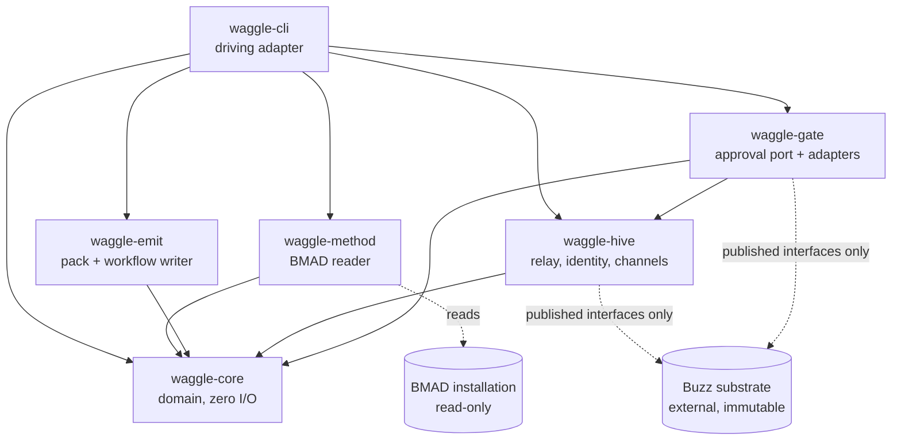
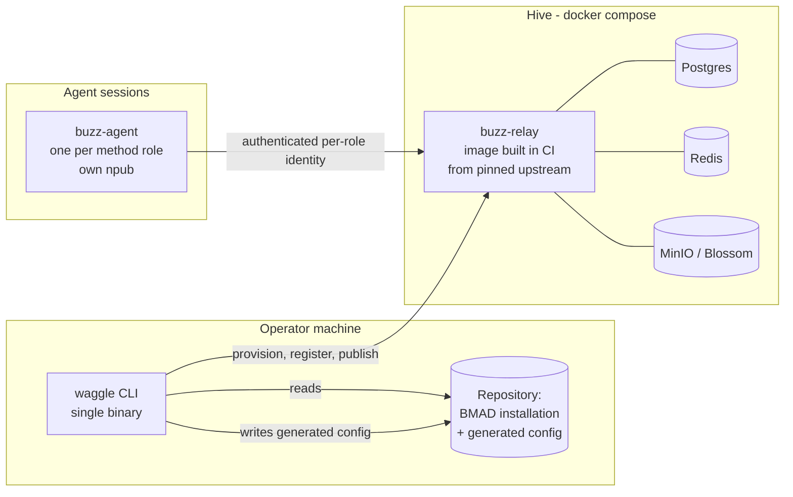
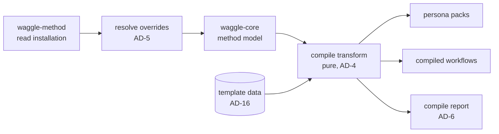
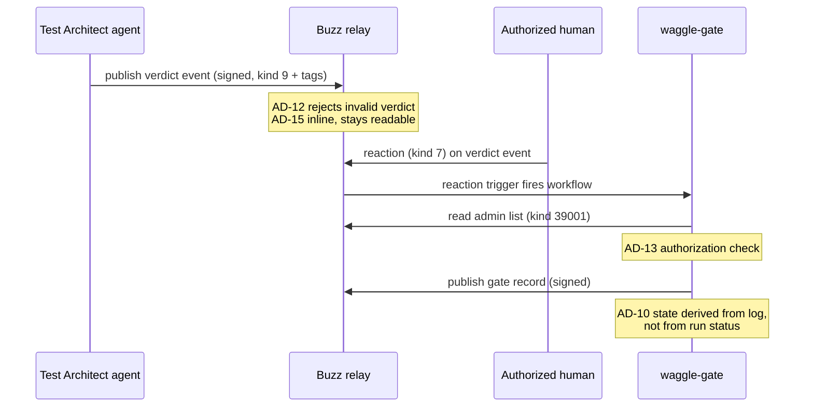
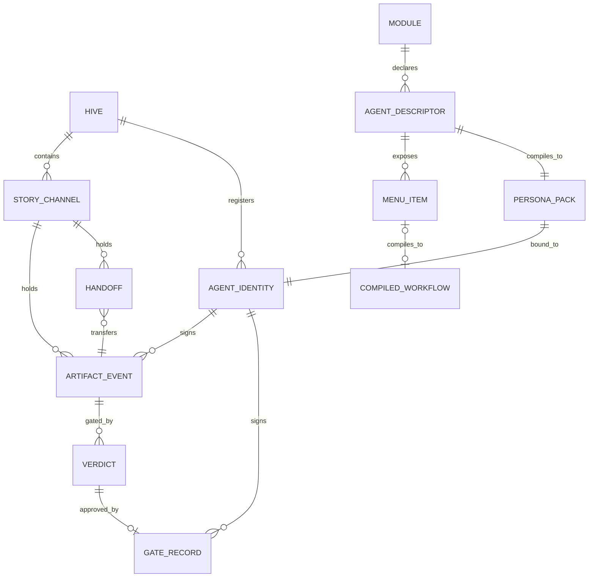

# Architecture Spine — waggle

**Traceability.** Every concept is sourced: `[BUZZ]` Buzz `v0.4.26` · `[NOSTR]` the NIPs ·
`[BMAD]` BMAD Method `6.10.0` · `[WAGGLE]` original.

## Design Paradigm

**Hexagonal — ports and adapters.** `[WAGGLE]`

waggle is a transform sitting between two systems it does not own. Hexagonal is the paradigm
that makes "do not own" structural rather than aspirational: the domain knows only its own
types, and every foreign contract — the method installation, the relay, the approval
mechanism — enters through a port with an adapter behind it. When an upstream contract
churns, exactly one adapter changes.

| Hexagon layer | Crate | Owns |
|---|---|---|
| Domain | `waggle-core` | Method model, hive model, the compile transform. Zero I/O. |
| Driven port + adapter | `waggle-method` | Reading a BMAD installation `[BMAD]` |
| Driven port + adapter | `waggle-emit` | Writing persona packs and workflow YAML |
| Driven port + adapter | `waggle-hive` | Talking to the relay: identity, membership, channels, canvases, events `[BUZZ]` |
| Driven port + adapter | `waggle-gate` | The approval mechanism — the single churn-absorbing seam |
| Driving adapter | `waggle-cli` | The only crate that wires the others |

This mirrors the substrate's own layering, where `buzz-core` is zero-I/O and only the
top-level binary imports everything. `[BUZZ]` Matching it is deliberate: it keeps a future
upstream contribution idiomatic.

## Invariants & Rules

### AD-1 — The domain crate performs no I/O

- **Binds:** all
- **Prevents:** business rules leaking into adapters, where they become untestable and get
  reimplemented per adapter
- **Rule:** `waggle-core` declares no dependency that opens a file, socket, process, or
  clock. It exposes pure functions over owned types. Everything else depends on it; it
  depends on nothing of ours.

### AD-2 — The substrate is external and immutable `[ADOPTED]`

- **Binds:** all; FR-9, NFR-3
- **Prevents:** the distribution silently becoming a fork
- **Rule:** No waggle code path writes to a substrate file, image layer, or database. All
  substrate interaction goes through `waggle-hive` using published interfaces — relay
  WebSocket, REST, its own CLIs. Any capability that would require a substrate change is
  recorded in `docs/upstream-issues.md` and left unimplemented. CI asserts the substrate
  checkout is byte-unchanged after the full test suite.

### AD-3 — The method installation is read-only; waggle writes only to two places

- **Binds:** FR-1, FR-2, FR-3
- **Prevents:** waggle configuration being destroyed by the next `bmad-method install`, which
  regenerates `_bmad/config.toml` `[BMAD]`
- **Rule:** waggle reads anywhere under `_bmad/` and `.claude/skills/`. It writes only to
  `_bmad/custom/` (its own settings, the method's designated override location) and to its
  own output directory. Writing to any other path under the method installation is a defect.

### AD-4 — Compile is a pure function of declared inputs

- **Binds:** FR-1, FR-2, FR-4, FR-7; NFR-1
- **Prevents:** generated configuration that differs between machines, so it cannot be
  committed, diffed, or reviewed
- **Rule:** The compile transform takes a fully-materialized input model and returns an
  output model. It reads no clock, environment variable, absolute path, or random source.
  Collections are emitted in a declared deterministic order. Two compiles of unchanged input
  produce byte-identical output, asserted by a snapshot test.

### AD-5 — The override merge is ported, and a differential test is mandatory

- **Binds:** FR-3
- **Prevents:** waggle resolving an agent descriptor differently from the method itself,
  producing a persona that is silently wrong rather than visibly broken
- **Rule:** `waggle-method` implements the base → team → user merge natively — scalars
  override, tables deep-merge, arrays of tables keyed by `code`/`id` replace matching entries
  and append new ones, all other arrays append. `[BMAD]` A differential test runs the
  method's own `resolve_customization.py` over every installed agent and asserts equality
  with waggle's result. **This test is not optional and may not be skipped in CI**; choosing
  a language outside the method's ecosystem is what made it load-bearing.

### AD-6 — Nothing is dropped silently

- **Binds:** FR-2, FR-5, FR-6; NFR-4
- **Prevents:** a method field or capability vanishing during compilation, which is
  undetectable at runtime and looks like the agent is simply behaving oddly
- **Rule:** Every descriptor field and every menu item is, in the compile report, one of:
  mapped, carried as instruction material, or explicitly dropped with a reason. A field the
  compiler does not recognize is reported as unknown — never ignored. A module producing zero
  output is a warning, not a silent success.

### AD-7 — Menu items are a sum type, not a uniform mapping

- **Binds:** FR-4, FR-5
- **Prevents:** the compiler assuming every agent capability becomes a workflow — false
  already in the pilot module `[BMAD]`
- **Rule:** A menu item is modeled as an enum with exactly two variants: a dispatchable
  reference, which compiles to one workflow; and a prompt, which compiles to persona
  instruction material and no workflow. Encountering a prompt variant is normal control flow,
  not an error path.

### AD-8 — Event kinds: standard first, claims require written rationale

- **Binds:** FR-15, FR-17, FR-18, FR-22, FR-24; NFR-6
- **Prevents:** the log becoming readable only by waggle, destroying the portability the
  product claims
- **Rule:** Use a standard kind wherever one exists — group message `9` with typed tags for
  artifacts and handoffs, reaction `7` for gate triggers, NIP-34 `1617` for developer output,
  NIP-34 `1630`–`1633` for gate outcome status. `[NOSTR]` A custom kind may be claimed only
  when no standard kind fits, and each claim is recorded with its rationale in a committed
  kind registry. Substrate-proprietary kinds `40002`/`40003` are forbidden — they work on the
  wire but no standard client reads them. `[BUZZ]` Reserved substrate ranges `43001`–`43006`,
  `46001`–`46012`, `48001` are never used. `[BUZZ]`

### AD-9 — Auditable state never rides an ephemeral kind

- **Binds:** FR-15, FR-17, FR-22; §9 of the PRD
- **Prevents:** an artifact or gate record that cannot be reconstructed later, because the
  relay never stored it
- **Rule:** No artifact event, handoff, gate verdict, or gate record uses a kind in
  `20000`–`29999`; the substrate does not persist that range. `[BUZZ]` Ephemeral kinds are
  permitted only for presence and typing.

### AD-10 — The log is the authority on gate state; run status is advisory

- **Binds:** FR-19, FR-22, FR-23; NFR-10
- **Prevents:** waggle reporting a gate outcome derived from a substrate mechanism known to
  be incomplete — upstream marks approval-step runs failed rather than suspended `[BUZZ]`
  (UP-01)
- **Rule:** Gate state is derived by reading the event log: pair verdict events with the
  approval reactions that reference them. Substrate workflow run status is never the source
  of truth for whether a gate passed. Exactly one crate, `waggle-gate`, may call the
  substrate's approval mechanism; a structural test enforces the boundary.

### AD-11 — The gate port has two adapters and a tripwire

- **Binds:** FR-19, FR-23
- **Prevents:** the degraded implementation quietly outliving the upstream defect that
  justified it
- **Rule:** `waggle-gate` defines one `GateBackend` port with two implementations:
  `LogReconciledGate` (default; AD-10) and `SubstrateNativeGate` (dormant; assumes durable
  approval suspension). Selection is configuration, not code. A test asserts the pinned
  substrate's *current* approval behavior; when upstream fixes UP-01 that test fails,
  forcing a deliberate re-pin rather than a silent divergence.

### AD-12 — Verdicts are a closed enum; a bare waiver is rejected

- **Binds:** FR-21
- **Prevents:** gate outcomes drifting into free text, which cannot be queried or enforced
- **Rule:** A verdict is exactly one of `PASS`, `CONCERNS`, `FAIL`, `WAIVED`. `[BMAD]`
  `CONCERNS` and `WAIVED` require a non-empty rationale; a verdict event without one is
  rejected at publish time, not at read time.

### AD-13 — Gate authorization derives from the substrate's own roles

- **Binds:** FR-20; resolves OQ-5
- **Prevents:** waggle maintaining a parallel approver list that drifts from the workspace's
  actual membership
- **Rule:** Authorization to fire a gate is read from the relay-signed admin list
  (kind `39001`) for the channel. `[BUZZ]` `PASS`, `CONCERNS`, and `FAIL` require admin or
  owner; `WAIVED` requires owner. waggle publishes no approver roster of its own. A reaction
  from an unauthorized identity is recorded but does not advance the gate.

### AD-14 — Secret key material never crosses into the domain

- **Binds:** FR-11, FR-12; NFR-7
- **Prevents:** an nsec reaching a code path that serializes, logs, or reports — the one
  failure with no remediation
- **Rule:** The identity port exposes public identifiers and a sign operation. Secret key
  material is confined to `waggle-hive`'s identity adapter, is held in a type that does not
  implement debug or display formatting, and is never returned across the port. Secrets are
  written only to paths covered by the repository ignore rules. A test asserts no generated
  artifact or report contains secret material.

### AD-15 — Artifact transport is chosen by size, against the substrate's real limit

- **Binds:** FR-16; resolves OQ-2
- **Prevents:** either truncating large artifacts, or hiding small ones — especially gate
  verdicts — behind a blob reference a third-party client cannot follow
- **Rule:** An artifact whose serialized event fits the substrate frame limit is published
  inline. One that does not is published as a content-addressed reference carrying a hash
  that verifies the retrieved bytes. The threshold is read from the pinned substrate's actual
  limit (65,536 bytes at `v0.4.26` `[BUZZ]`), never hard-coded independently. Gate verdicts
  and handoffs are expected to be inline, preserving direct readability.

### AD-16 — Templates are data; the compiler has no module-specific branch

- **Binds:** FR-10, FR-25, FR-26; SM-5, SM-C1
- **Prevents:** the "compiler" degenerating into hand-written configuration with a build step
- **Rule:** Per-module channel and canvas templates are declarative data files loaded at
  runtime. No compiler code path names a specific module. Adding module support means adding
  template data and nothing else; a module without templates provisions nothing and is
  reported. A conditional on a module identifier anywhere in `waggle-core` or `waggle-emit`
  is a defect.

### AD-17 — The substrate image is built in CI from unmodified upstream sources

- **Binds:** FR-8, NFR-5; resolves OQ-6
- **Prevents:** every operator needing the substrate's full build toolchain, which no
  published image currently relieves them of — upstream ships desktop binaries only `[BUZZ]`
- **Rule:** waggle CI builds the relay image from upstream's own `Dockerfile` at the pinned
  release tag, with no patch applied, and publishes it to waggle's registry. The compose
  bundle references that image by immutable digest. The build is reproducible from the pinned
  tag alone; the image's provenance names the upstream tag and commit. Operators need only a
  container runtime.

### AD-18 — Refuse outside the supported version range

- **Binds:** FR-28; NFR-5
- **Prevents:** compiling against contracts that have moved, producing plausible but wrong
  output
- **Rule:** Substrate version and method version are each declared as a supported range in
  one committed location. Any operation depending on those contracts runs a preflight and
  refuses outside the range, naming found and expected versions. An override flag exists, is
  explicit, and warns. No floating version reference exists anywhere in the repository.

### AD-19 — Body materialization is discovered, never assumed

- **Binds:** FR-1; resolves OQ-7
- **Prevents:** the reader hard-coding a path that is correct only for one agent tool — the
  method's skill manifest records logical paths that do not exist on disk `[BMAD]`
- **Rule:** `waggle-method` treats the manifest's `path` field as a logical identifier and
  resolves the behavioral body through the tool directory recorded in the installation
  manifest's own tool list. A body that cannot be resolved is a named error identifying the
  agent, the module, and the tool directory searched.

### AD-20 — Every command is machine-first

- **Binds:** FR-27; NFR-9
- **Prevents:** capabilities reachable only by a human reading a terminal, in a product whose
  primary consumers are agents and automation
- **Rule:** Every command accepts a flag emitting structured output on stdout, with
  diagnostics on stderr. No command requires interactive input to complete. Exit codes are a
  fixed taxonomy: success, user error, upstream-contract error, system failure.

### Dependency direction

Arrows point the only way a dependency may go. Any edge not drawn is forbidden.



## Consistency Conventions

| Concern | Convention |
|---|---|
| Crate naming | `waggle-<layer>`; the domain crate is `waggle-core`, mirroring the substrate's own convention `[BUZZ]` |
| Domain type naming | Glossary terms from PRD §3 verbatim — `Hive`, `Module`, `AgentDescriptor`, `MenuItem`, `PersonaPack`, `CompiledWorkflow`, `AgentIdentity`, `ArtifactEvent`, `Handoff`, `Gate`, `Verdict`, `GateRecord`. A synonym in code is a defect. |
| Port naming | `<Noun>Port` for the trait, `<Adjective><Noun>Adapter` for implementations. The gate port is `GateBackend` (fixed by AD-11). |
| Generated file naming | `<module>/<agent-id>.pack.json`, `<module>/<agent-id>.<menu-code>.workflow.yaml` — stable across recompiles (AD-4) |
| Identifiers | Method identifiers pass through unchanged; waggle never re-derives an id the method already owns |
| Dates and times | RFC 3339, UTC. Never emitted into compiled artifacts (AD-4); permitted in events and reports. |
| Event tags | Lowercase kebab-case tag names, `waggle-` prefixed where waggle-specific, mirroring the substrate's own `buzz-` tag convention `[BUZZ]` |
| Priorities | `P0`–`P3` exactly; no other priority vocabulary anywhere |
| Errors | One error enum per crate, non-exhaustive, each variant naming the specific artifact/module/version involved (NFR-4). No stringly-typed errors crossing a port. |
| Structured output | One versioned envelope shape for every command's machine output; additive changes only within a major version |
| Config | Declarative files under version control. No behavior configured by environment variable except secrets and endpoints. |
| Logging | Structured, leveled, on stderr. Secret material never reaches a log call (AD-14). |
| Tests | Snapshot tests for all generated output (AD-4); the resolver differential test (AD-5); the structural boundary test (AD-10); the upstream-behavior tripwire (AD-11) |

## Stack

Seed. Verified current at authoring, 2026-07-28.

| Name | Version |
|---|---|
| Rust toolchain | 1.95.0 (pinned via `rust-toolchain.toml`) — matched to the substrate's own pin so one toolchain serves both |
| `nostr` | 0.44.6 |
| `nostr-sdk` | 0.44.1 |
| `clap` | 4.6.4 |
| `serde` | 1.0.229 |
| `toml` | 1.1.3 |
| `csv` | 1.4.0 |
| `serde_norway` (YAML; `serde_yaml` is deprecated as of 0.9.34) | 0.9.42 |
| `insta` (snapshot testing) | 1.48.0 |
| Buzz substrate | `v0.4.26` |
| BMAD Method | `6.10.0` |
| Postgres / Redis / MinIO | as pinned by the substrate's own compose |

The substrate requires Rust 1.88+ for its own build `[BUZZ]`; AD-17 confines that requirement
to CI. Contributors building the substrate locally need it; operators do not.

## Structural Seed

### Container topology



### Compile pipeline



### Gate firing



### Core entities

Names and relationships only. Cardinality is binding; attributes are the code's.



Two cardinalities are load-bearing and easy to get wrong. A `MENU_ITEM` compiles to **zero or
one** `COMPILED_WORKFLOW`, never many — the zero case is AD-7's prompt variant. A `VERDICT`
has **at most one** `GATE_RECORD`; a second approval on the same verdict is a duplicate to
reject, not a second record to store.

### Source tree

```text
waggle/
  crates/
    waggle-core/      # domain types + compile transform, zero I/O (AD-1)
    waggle-method/    # BMAD installation reader + override merge (AD-3, AD-5, AD-19)
    waggle-emit/      # persona pack + workflow YAML emitters (AD-4)
    waggle-hive/      # relay client, identity, membership, channels, canvases (AD-2, AD-14)
    waggle-gate/      # GateBackend port + two adapters (AD-10, AD-11, AD-13)
    waggle-cli/       # the only crate that wires the others (AD-20)
  templates/          # per-module channel + canvas template data (AD-16)
  deploy/compose/     # hive bundle, image pinned by digest (AD-17)
  docs/
  BUZZ_VERSION        # substrate + method version pins (AD-18)
  rust-toolchain.toml
```

## Capability → Architecture Map

| Capability | Lives in | Governed by |
|---|---|---|
| FR-1 Read installation | `waggle-method` | AD-3, AD-19, AD-18 |
| FR-2 Personas | `waggle-core` + `waggle-emit` | AD-4, AD-6 |
| FR-3 Override merge | `waggle-method` | **AD-5** |
| FR-4 Workflow emission | `waggle-core` + `waggle-emit` | AD-4, AD-7 |
| FR-5 Prompt-only items | `waggle-core` | **AD-7** |
| FR-6 Compile report | `waggle-core` | AD-6 |
| FR-7 Determinism | `waggle-core` + `waggle-emit` | AD-4 |
| FR-8 Stand up hive | `deploy/compose` | **AD-17** |
| FR-9 Substrate integrity | all | **AD-2** |
| FR-10 Channel provisioning | `waggle-hive` + `templates` | AD-16 |
| FR-11 Identity provisioning | `waggle-hive` | **AD-14** |
| FR-12 Registration | `waggle-hive` | AD-2, AD-14 |
| FR-13 Runtime config | `waggle-emit` | AD-4 |
| FR-14 Profile publication | `waggle-hive` | AD-8 |
| FR-15 Artifact events | `waggle-hive` | AD-8, AD-9, AD-15 |
| FR-16 Oversized artifacts | `waggle-hive` | **AD-15** |
| FR-17 Handoffs | `waggle-hive` | AD-8, AD-9 |
| FR-18 Patch events | `waggle-hive` | AD-8 |
| FR-19 Gate interface | `waggle-gate` | **AD-11**, AD-10 |
| FR-20 Reaction trigger | `waggle-gate` | AD-13 |
| FR-21 Verdict vocabulary | `waggle-core` | **AD-12** |
| FR-22 Gate record | `waggle-gate` | AD-9, AD-10 |
| FR-23 Degraded mode | `waggle-gate` | **AD-10**, AD-11 |
| FR-24 Priority tags | `waggle-core` | AD-8 |
| FR-25/26 Templates | `templates` | **AD-16** |
| FR-27 Command surface | `waggle-cli` | AD-20 |
| FR-28 Version preflight | `waggle-cli` | **AD-18** |

## Deferred

Named, not decided. Each with why it can wait.

- **Persona pack and agent-runtime schemas.** The substrate does not document them; they must
  be read from `crates/buzz-persona`, `buzz-agent`, `buzz-cli`, and `buzz-admin` at the pinned
  tag. AD-1 and AD-14 fix where that knowledge lands regardless of its shape, so the spine
  holds without it. **This is Story 1.1's output and the largest remaining unknown**
  (OQ-3 / UP-04).
- **The kind registry's initial contents.** AD-8 fixes the *rule* for claiming a kind. Which
  kinds are actually claimed cannot be settled before the artifact and handoff event shapes
  are designed, which is post-pilot scope.
- **Canvas template format.** Depends on the substrate's canvas MCP contract, unread.
- **Agent session concurrency defaults.** NFR-8 requires a bound; the number needs a running
  hive to calibrate.
- **Key custody beyond local files.** AD-14 fixes the boundary. Whether secrets live in files,
  an OS keychain, or an external manager is an operator-facing choice that does not change the
  boundary.
- **Key rotation.** Not needed before a hive exists. AD-14's port shape does not preclude it.
- **Multi-hive operation.** Explicitly out of MVP scope; identity is community-scoped upstream
  `[BUZZ]`, so this is an addition rather than a rework.
- **Publishing modules as signed events.** The module-builder stretch goal; needs AD-8's
  registry populated first.
- **Observability envelope.** The substrate ships Prometheus `[BUZZ]`; whether waggle emits
  its own metrics is unanswered and not blocking.
- **Release and versioning mechanics** for waggle's own binary. AD-18 fixes the pinning
  discipline; the release process itself is an ops decision.
